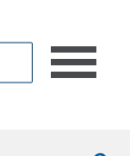
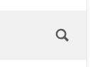
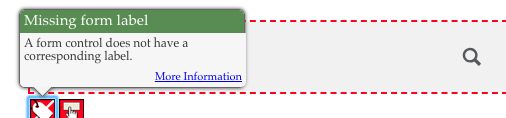
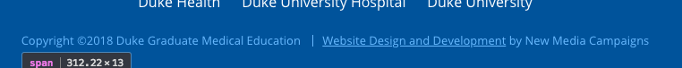
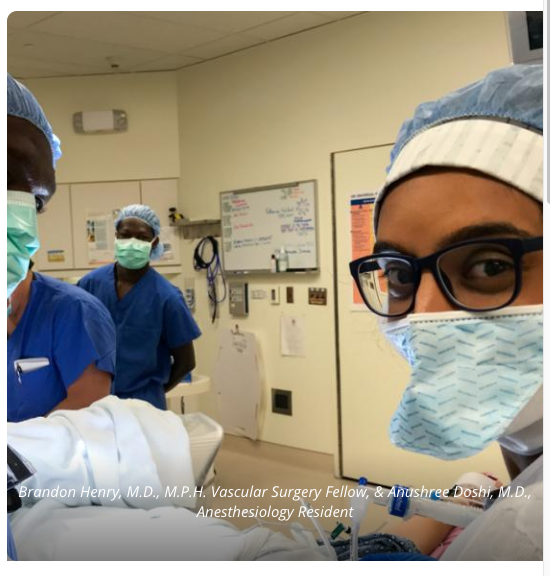

<style>
img { max-width:400px; height: auto;}
img,iframe {border: 1px solid #ccc;}
a { color: blue; }
pre code { font: 9px; }
pre { font: inherit; word-wrap: break-word; background: none; border: none; }
.force-thumbnail { width: 150px; }
.force-thumbnail img { height: auto; }
</style>

# Gme.duke.edu/ Homepage Assessment 07/20/2018

__https://gme.duke.edu/__

__Screenshot:__


<br>

## Offscreen content is not hidden from assistive technology
Manual Test: Offscreen content is hidden from assistive technology

Description:<br>
Offscreen content is hidden with display: none or aria-hidden=true. [Learn more](https://developers.google.com/web/fundamentals/accessibility/how-to-review#try_it_with_a_screen_reader).

### Main navigation is not keyboard or screen reader accessible [Priority]

Issues: 1. The main menu hamburger button is not focusable because `<a>` elements with no `href` attribute cannot receive focus.  2. When a screen reader comes across this link it will only say "nav". Since this is the only way to navigate the website, we should add some screen reader only text to clearly indicate that this is the main menu. 3. When a user tabs through the website, the keyboard focus indicator gets lost inside the the off-screen main menu.

__Visual location:__



__HTML location:__

```html
<a id="navtoggle">
  <span class="n">n</span>
  <span class="a">a</span>
  <span class="v">v</span>
</a>
```

#### Suggested solution:

Truly hide the menu when it is intended to be off-screen. Add correct ARIA attributes and states. Make the toggle button keyboard and screen reader focusable.

Just paste this in the JS anywhere after the menu is initialized:

```js

var $navToggle = jQuery('#navtoggle');
var $navContent = jQuery('#primary-nav > div');

$navToggle.prepend('<span class="element-invisible">Main menu toggle</span>');
$navContent.hide();

$navToggle.attr({
    'href': '#',
    'aria-expanded': 'false',
    'aria-haspopup': 'true',
    'aria-label': 'toggle main navigation'
});

$navToggle.on('click', function() {
    if (jQuery('html').hasClass('nav-open')) {
        jQuery(this).attr('aria-expanded','true');
        $navContent.show();
    } else {
        jQuery(this).attr('aria-expanded','false');
        $navContent.hide();
    }
});
```

Optionally, the hamburger could start with the prepended html and the ARIA attributes indicated with the JS above.

<br>

<hr>

<br>

## Buttons do not have an accessible name

When a button doesn't have an accessible name, screen readers announce it as "button", making it unusable for users who rely on screen readers. [Learn more](https://dequeuniversity.com/rules/axe/2.2/button-name?application=lighthouse).


### The Search `button` has no `value` attribute and it contains no inner text to indicate its purpose [Priority]

__Visual location:__




#### HTML location:

```html
<button type="submit" class="button-submit">
  <svg>
    <path></path>
  </svg>
</button>
```

#### Suggested solution:

There are many simple ways to fix this issue. Choose one of the following:

__Option 1:__

Add `value="search"` to the button element.

```html
<button type="submit" class="button-submit" value="Search">
  <svg>
    <path></path>
  </svg>
</button>
```


Note: It _must_ be the first child of it’s parent element.

__Option 2:__

Add screen reader only text `<span class="element-invisible">Search</span>`:

```html
<button type="submit" class="button-submit">
+  <span class="element-invisible">Search</span>
  <svg>
    <path></path>
  </svg>
</button>
```

<details>
<summary>_Additional debugging details_</summary>
Selector:<br>
<code>1,HTML,1,BODY,3,SECTION,0,FORM,1,BUTTON</code>

Path:<br>
<code>button</code>

More detailed explanation:<br>
Fix all of the following:
<br>Element is in tab order and does not have accessible text

Fix any of the following:
<br>Element has a value attribute and the value attribute is empty
<br>Element has no value attribute or the value attribute is empty
<br>Element does not have inner text that is visible to screen readers
<br>aria-label attribute does not exist or is empty
<br>aria-labelledby attribute does not exist, references elements that do not exist or references elements that are empty or not visible
<br>Element&#39;s default semantics were not overridden with role=&#34;presentation&#34;
<br>Element&#39;s default semantics were not overridden with role=&#34;none&#34;


</details>

<hr>

<br>

<br>

## Headings don't skip levels
Manual Test: Headings don&#39;t skip levels

Description:<br>
Headings are used to create an outline for the page and heading levels are not skipped. [Learn more](https://developers.google.com/web/fundamentals/accessibility/how-to-review#take_advantage_of_headings_and_landmarks).

### Missing `<h1>`
Pages should have one `<h1>` for accessibility, it also helps with search engine optimization if the `<h1>` has text in it. 

Change `<div id="logo">` to `<h1 id="logo">`.

the `<h1>` will cause an unwanted margin below the logo. I suggest adding `margin: 0` to the `#logo` so it looks the same as when we started.

The website could just wrap the logo in an `<h1>` instead.

Everything else looks good!

<br>

<hr>

<br>


## Links do not have a discernible name [Priority]

Link text (and alternate text for images, when used as links) that is discernible, unique, and focusable improves the navigation experience for screen reader users. [Learn more](https://dequeuniversity.com/rules/axe/2.2/link-name?application=lighthouse).


### The logo `<a>` link has no text inside.

__Visual location:__


__HTML Location__:

```html
<a href="/" class="logo-link">
```

Empty links are not read to a screen reader user, as a result, they will no know what the link does or where it would take them.

#### Suggested solution:

Add screen reader only text inside link.

```html
<a href="/" class="logo-link">
  <span class="desktop-only">
    <svg viewBox="0 0 697 67"></svg>
  </span>
  <span class="element-invisible">Duke Health Graduate Medical Education</span>
</a>

```

<details>
<summary>_Additional debugging details_</summary>
Selector:<br>
<code>1,HTML,1,BODY,1,HEADER,0,DIV,0,DIV,0,A</code>

Path:<br>
<code>.logo-link</code>

More detailed explanation:<br>
Fix all of the following:
<br>Element is in tab order and does not have accessible text

Fix any of the following:
<br>Element does not have text that is visible to screen readers
<br>aria-label attribute does not exist or is empty
<br>aria-labelledby attribute does not exist, references elements that do not exist or references elements that are empty or not visible
<br>Element&#39;s default semantics were not overridden with role=&#34;presentation&#34;
<br>Element&#39;s default semantics were not overridden with role=&#34;none&#34;
</details>

<hr>

<br>


## HTML5 landmark elements are used to improve navigation
Manual Test: HTML5 landmark elements are used to improve navigation

Description:<br>
Landmark elements (&lt;main&gt;, &lt;nav&gt;, etc.) are used to improve the keyboard navigation of the page for assistive technology. [Learn more](https://developers.google.com/web/fundamentals/accessibility/how-to-review#take_advantage_of_headings_and_landmarks).

### Missing `<main>` element

The website has a `<header>` and a `<footer>`.  We just need to add a `<main>` element.  It allows the screen reader user to skip to the main content area.

#### Suggested Solution:

Wrap the `<section>` elements in one `<main>` element.

```html 
+ <main>
  	<div class="bound-layout"></div>
  	<section class="home-intro"></section>
  	<section class="home-content"></section>
  	<section class="module module-image-banner module-image-banner-left" style="background-image: url(https://gme.duke.edu/sites/gme.duke.edu/files/styles/masthead/public/life-in-durham-2.jpg?itok=uHEngSP5);"></section>
  	<section class="module module-image-banner module-image-banner-left" style="background-image: url(https://gme.duke.edu/sites/gme.duke.edu/files/styles/masthead/public/default-banner-min.jpg?itok=_Lo9Syer);"></section>
+ </main>
```

Everything else looks good!

<br>

<hr>

<br>

## Form elements do not have associated labels 

Labels ensure that form controls are announced properly by assistive technologies, like screen readers. [Learn more](https://dequeuniversity.com/rules/axe/2.2/label?application=lighthouse).


### This element is missing a label [Priority]

__Visual location:__



__HTML location:__

```html
<input type="search" name="keyword" class="input-search" placeholder="Search">
```

#### Suggested solution:
Add `<label for="something">` to associate the label with that form field. If the element does not have and ID attribute to associate add `id="something"`.
If you wish to visually hide the label add class `.element-invisible` to the `<label>`.


<details>
<summary>_Additional debugging details_</summary>
Selector:<br>
<code>1,HTML,1,BODY,3,SECTION,0,FORM,0,INPUT</code>

Path:<br>
<code>input</code>

More detailed explanation:<br>
Fix any of the following:
<br>aria-label attribute does not exist or is empty
<br>aria-labelledby attribute does not exist, references elements that do not exist or references elements that are empty or not visible
<br>Form element does not have an implicit (wrapped) &lt;label&gt;
<br>Form element does not have an explicit &lt;label&gt;
<br>Element has no title attribute or the title attribute is empty
</details>

<hr>

<br>


<br>


## `[user-scalable="no"]` is used in the `<meta name="viewport">` element or the `[maximum-scale]` attribute is less than 5.

Disabling zooming is problematic for users with low vision who rely on screen magnification to properly see the contents of a web page. [Learn more](https://dequeuniversity.com/rules/axe/2.2/meta-viewport?application=lighthouse).


__HTML location:__

```html
<meta name="viewport" id="viewport" content="width=device-width,minimum-scale=1.0,maximum-scale=1.0,initial-scale=1.0">
```

#### Suggested Solution:

Option 1:

In Drupal this can also be done in the template.php file with something similar to this (‘alpha-viewport’ $head_element name varies depending on the base theme):

<pre>
$head_elements['alpha-viewport'] = array(
  '#type' => 'html_tag',
  '#tag' => 'meta',
  '#attributes' => array(
    'name' => 'viewport',
    'content' => 'width=device-width, initial-scale=1, maximum-scale=5, minimum-scale=1, user-scalable=yes',
  ),
);
</pre>

Option 2:

Go into the html.tpl.php file and change it there.

Changing the maximum scale to 5 will allow people to scale the page. Depending on how the website is styled, it could cause unexpected issues with the mobile view of the site getting a horizontal scrollbar. It is worth testing to ensure that does not happen.

```html
<meta name="viewport" content="width=device-width, initial-scale=1, maximum-scale=5" user-scalable="yes">
```


<details>
<summary>_Additional debugging details_</summary>
Selector:<br>
<code>1,HTML,0,HEAD,16,META</code>

Path:<br>
<code>#viewport</code>

More detailed explanation:<br>
Fix any of the following:
<br>&lt;meta&gt; tag disables zooming on mobile devices
</details>

<hr>

<br>


<br>

## Background and foreground colors do not have a sufficient contrast ratio.

Low-contrast text is difficult or impossible for many users to read. [Learn more](https://dequeuniversity.com/rules/axe/2.2/color-contrast?application=lighthouse).


### The element  _"n"_, _"a"_, _"v"_ has low contrast.

This is a false positive, but false positives have been used in litigation to support claims of inaccessible websites, because lawyers don't understand this stuff. So, we must fix it anyway.

__Visual location:__


__HTML location:__

```html
<a id="navtoggle">
  <span class="n">n</span>
  <span class="a">a</span>
  <span class="v">v</span>
</a>
```

#### Suggested solution:

  Element has insufficient color contrast of 1.14 (foreground color: #00539b, background color: #494a4d, font size: 0.0pt, font weight: normal). Expected contrast ratio of 4.5:1

Add `color` to existing selector:

```css
#navtoggle > span {
+  color: #fff;
 display: block;
 ...
}
```

Visually, it will be the same, but it will not throw the error anymore.

<details>
<summary>_Additional debugging details_</summary>
Selector:<br>
<code>1,HTML,1,BODY,1,HEADER,0,DIV,2,A,1,SPAN</code>

More detailed explanation:<br>
Fix any of the following:
<br>Element has insufficient color contrast of 1.14 (foreground color: #00539b, background color: #494a4d, font size: 0.0pt, font weight: normal). Expected contrast ratio of 4.5:1
</details>

<br>

<hr>

<br>


### The element _"Copyright ©2018 Duke Graduate Medical Education"_ and _"Website Design and Development by New Media Campaigns"_ has low contrast. [Priority]

__Visual location:__



__HTML location:__

```html
<span>Copyright ©2018 Duke Graduate Medical Education</span>
```

```html
<span>
  <a href="http://newmediacampaigns.com" target="_blank">
    Website Design and Development
  </a>
  by New Media Campaigns
 </span>
```

#### Suggested solution:

  Element has insufficient color contrast of 3.67 (foreground color: #68b9ff, background color: #00539b, font size: 9.8pt, font weight: normal). Expected contrast ratio of 4.5:1

Change text color to closest compliant color.

Current color:
<https://webaim.org/resources/contrastchecker/?fcolor=68B9FF&bcolor=00539B>

Closest compliant color:
<https://webaim.org/resources/contrastchecker/?fcolor=94CDFF&bcolor=00539B>

```css
.footer-copy {
  clear: both;
  text-align: center;
  font-size: 13px;
  line-height: 1;
-  color: #68b9ff;
+  color: 94CDFF
}

```

<details>
<summary>_Additional debugging details_</summary>
Selector:<br>
<code>1,HTML,1,BODY,7,FOOTER,0,DIV,2,P,0,SPAN</code>

Path:<br>
<code>.footer-copy > span:nth-child(1)</code>

More detailed explanation:<br>
Fix any of the following:
<br>Element has insufficient color contrast of 3.67 (foreground color: #68b9ff, background color: #00539b, font size: 9.8pt, font weight: normal). Expected contrast ratio of 4.5:1
</details>

<hr>

<br>


### The link _"Website Design and Development"_ has low contrast. [Priority]

__Visual location:__


__HTML location:__

```html
<a href="http://newmediacampaigns.com" target="_blank">Website Design and Development</a>
```

#### Suggested solution:

  Element has insufficient color contrast of 3.67 (foreground color: #68b9ff, background color: #00539b, font size: 9.8pt, font weight: normal). Expected contrast ratio of 4.5:1

Change text color to closest compliant color.

Current color:
<https://webaim.org/resources/contrastchecker/?fcolor=68B9FF&bcolor=00539B>

Closest compliant color:
<https://webaim.org/resources/contrastchecker/?fcolor=94CDFF&bcolor=00539B>

```css
.footer-copy a {
-  color: #68b9ff;
+  color: #94CDFF;
  text-decoration: underline;
}
```


<details>
<summary>_Additional debugging details_</summary>
Selector:<br>
<code>1,HTML,1,BODY,7,FOOTER,0,DIV,2,P,1,SPAN,0,A</code>

Path:<br>
<code>a[href$="newmediacampaigns.com"]</code>

More detailed explanation:<br>
Fix any of the following:
<br>Element has insufficient color contrast of 3.67 (foreground color: #68b9ff, background color: #00539b, font size: 9.8pt, font weight: normal). Expected contrast ratio of 4.5:1
</details>

<hr>

<br>

## The user's focus is directed to new content added to the page
Manual Test: The user&#39;s focus is directed to new content added to the page

Description:<br>
If new content, such as a dialog, is added to the page, the user&#39;s focus is directed to it. [Learn more](https://developers.google.com/web/fundamentals/accessibility/how-to-review#start_with_the_keyboard).

### Main menu 
Does not indicate that new content is added to the screen, but this will be fixed by the task "Main navigation is not keyboard or screen reader accessible" above.

### Image caption hover states (x3)

__Visual location:__



__HTML location:__

```html
<div class="home-image home-image-3" style="background-image: url(https://gme.duke.edu/sites/gme.duke.edu/files/styles/home_big/public/henry-doshi-md2.jpg?itok=0fnQYg1X);">
  <div class="caption">
    Brandon Henry, M.D., M.P.H. Vascular Surgery Fellow, &amp; Anushree Doshi, M.D., Anesthesiology Resident
  </div>
</div>
```

#### Suggested solution:

I'm not sure what to do with this. Its technically a violation, but any fix we do on it would cause other accessibility problems, so ideally it should not be hidden, but its a low priority issue.


### Image caption low contrast (x3) [Priority]

There is also a contrast issue on the text here. It is illegible.

__Visual location:__


#### Suggested solution:

Add `text-shadow` to existing selector.

```css
.home-intro .home-image .caption {
+  text-shadow: 1px 0px 1px #000, 1px 1px 3px #000, -1px -1px 4px #000, 0px 0px 8px #000;
  position: absolute;
  left: 0;
  bottom: 0;
  z-index: 9;
  ...
}
```

That contrast fix makes the faux hidden text visible when it was 'hidden'. So we need to hide the overflow `overflow`.

Add `overflow: hidden` to new selector.

```css
.home-intro .home-image {
+  overflow: hidden;
}
```

Result:


<br>

<hr>

<br>

### "Learn more" is not descriptive link text [priority] 

Link text with the words "Learn more" is not descriptive. The screen reader will read _"Learn more"_ to screen reader users. As a result, they will not know what the link does or where it will take them.

__HTML location:__

```html
<a href="/about/directors-welcome" class="btn bigger">
  Learn More
</a>
```

__Visual location:__


#### Suggested solution:
Or add [screen reader only text](https://accessible360.com/accessible360-blog/use-aria-label-screen-reader-text/) inside the link.

Example:

```html
<a href="/about/directors-welcome" class="btn bigger">
  Learn More
  <span class="element-invisible"> about G M E</span>
</a>
```

<br>

__IMPORTANT NOTE: This rule applies to every "Learn more" link on the website.__

This is a major issue when outside entities audit our websites for compliance. They catch it every time.

<br>

<hr>

<br>


## Visual order on the page follows DOM order
Manual Test: Visual order on the page follows DOM order

Description:<br>
DOM order matches the visual order, improving navigation for assistive technology. [Learn more](https://developers.google.com/web/fundamentals/accessibility/how-to-review#try_it_with_a_screen_reader).

[Textise](https://www.textise.net/) is a neat tool for inspecting the natural order [View this website on Textise](https://www.textise.net/showText.aspx?strURL=gme.duke.edu/) of the website. If nothing has been done in JS to interfere the natural tab order, looking at that or viewing the source will basically follow the order of the markup.

Looks good!


<br>

<hr>


<br>


## Custom controls have ARIA roles
Custom controls have ARIA roles

Description:<br>
Custom interactive controls have appropriate ARIA roles. [Learn more](https://developers.google.com/web/fundamentals/accessibility/how-to-review#try_it_with_a_screen_reader).

Not applicable.

<hr>


<br>

## The page has a logical tab order
Manual Test: The page has a logical tab order

Description:<br>
Tabbing through the page follows the visual layout. Users cannot focus elements that are offscreen. [Learn more](https://developers.google.com/web/fundamentals/accessibility/how-to-review#start_with_the_keyboard).

Looks good!

<br>

<hr>


<br>

## Site works cross-browser
Site works cross-browser

Description:<br>
To reach the most number of users, sites should work across every major browser. [Learn more](https://developers.google.com/web/progressive-web-apps/checklist#site-works-cross-browser).

Looks good!

<hr>

<br>


## User focus is not accidentally trapped in a region
Manual Test: User focus is not accidentally trapped in a region

Description:<br>
A user can tab into and out of any control or region without accidentally trapping their focus. [Learn more](https://developers.google.com/web/fundamentals/accessibility/how-to-review#start_with_the_keyboard).

Looks good!

<br>

<hr>


<br>

## Interactive controls are keyboard focusable
Manual Test: Interactive controls are keyboard focusable

Description:<br>
Custom interactive controls are keyboard focusable and display a focus indicator. [Learn more](https://developers.google.com/web/fundamentals/accessibility/how-to-review#start_with_the_keyboard).

Not applicable.

<br>

<hr>

<br>


This report was partially generated by the [aXe Accessibility Engine](https://chrome.google.com/webstore/detail/axe/lhdoppojpmngadmnindnejefpokejbdd), [Lighthouse](https://developers.google.com/web/tools/lighthouse/), and the [WAVE](https://chrome.google.com/webstore/detail/wave-evaluation-tool/jbbplnpkjmmeebjpijfedlgcdilocofha) browser extension.